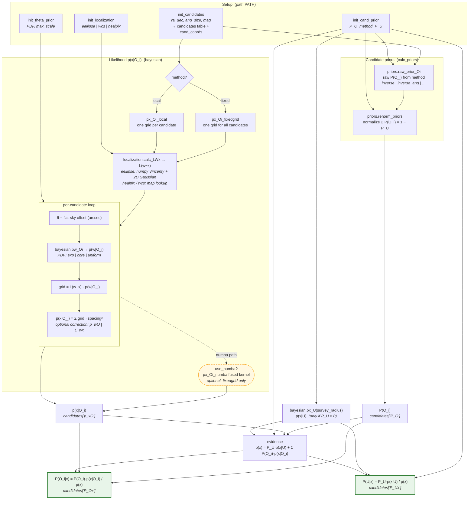

# PATH Calculation Flow

This diagram maps the end-to-end PATH (Probabilistic Association of
Transients to Hosts) calculation, from user inputs through the Bayesian
posteriors `P(O_i|x)` and `P(U|x)`. Boxes are annotated with the module
and function that implement each step.

The high-level orchestration lives in
[`path.PATH`](../astropath/path.py); the numerical work lives in
[`bayesian.py`](../astropath/bayesian.py),
[`priors.py`](../astropath/priors.py), and
[`localization.py`](../astropath/localization.py).

## Reading the diagram

- **Setup** — the four `init_*` methods on
  [`path.PATH`](../astropath/path.py) populate the candidates table,
  the candidate prior, the offset (θ) prior, and the localization.
- **Candidate priors** — `calc_priors` calls
  [`priors.raw_prior_Oi`](../astropath/priors.py) then
  [`priors.renorm_priors`](../astropath/priors.py) so the priors sum to
  `1 − P_U`.
- **Likelihood** — `calc_posteriors` computes `p(x|O_i)` via either
  [`px_Oi_fixedgrid`](../astropath/bayesian.py) (one shared grid) or
  [`px_Oi_local`](../astropath/bayesian.py) (a per-candidate grid). Both
  build `L(w−x)` with
  [`localization.calc_LWx`](../astropath/localization.py) and convolve
  it with the offset PDF [`pw_Oi`](../astropath/bayesian.py). For
  `fixedgrid`, an optional [numba kernel](../astropath/bayesian.py)
  (`px_Oi_numba`, `use_numba=True`) fuses the per-candidate loop; it
  falls back to numpy when numba is unavailable (see
  [performance.rst](performance.rst)).
- **Posteriors** — the unseen term `p(x|U)` from
  [`px_U`](../astropath/bayesian.py) (used only when `P_U > 0`) combines
  with `P(O_i)` and `p(x|O_i)` into the evidence `p(x)`, yielding the
  green results `P(O_i|x)` and `P(U|x)`.
