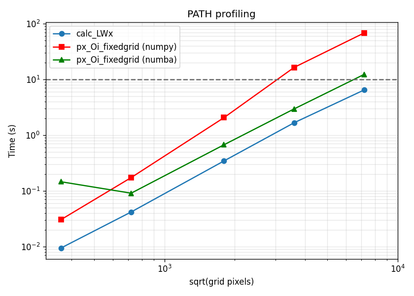
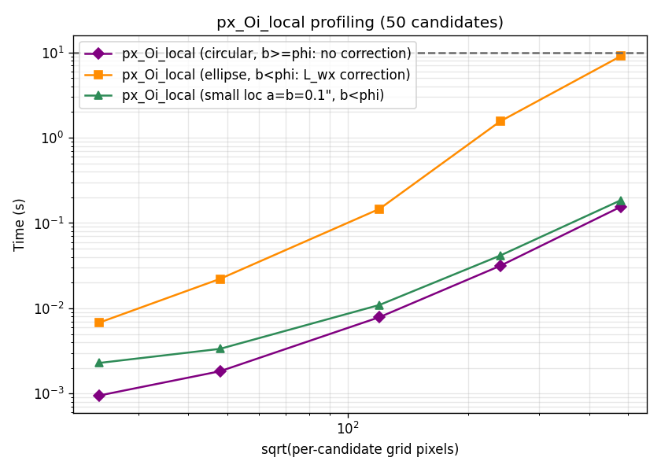

***********
Performance
***********

This doc describes the performance-oriented pieces of *astropath*:
the numpy-accelerated core calculations, the optional ``numba``
acceleration for the fixed-grid posterior, and the ``profiling``
module used to measure them.

numpy-accelerated core
======================

The two most expensive steps in a PATH analysis have been
re-implemented in pure numpy:

- ``localization.calc_LWx`` (the localization term :math:`L(w-x)`)
  for the error-ellipse (``eellipse``) localization now computes the
  angular separation and position angle with closed-form numpy
  formulae instead of ``astropy`` ``SkyCoord`` operations. Results are
  numerically identical (to roundoff) and the routine is several times
  faster on large grids.

- ``bayesian.px_Oi_fixedgrid`` (the fixed-grid :math:`p(x|O_i)`)
  pre-extracts the candidate and center coordinates into numpy arrays
  once, rather than reading ``astropy`` attributes inside the
  per-candidate loop.

- ``bayesian.px_Oi_local`` (the local-grid :math:`p(x|O_i)`, which
  builds one grid per candidate) has likewise been rewritten in pure
  numpy for the ``eellipse`` localization: it pre-extracts the
  coordinates once and evaluates :math:`L(w-x)` directly in a flat-sky
  tangent plane, removing every ``astropy`` call from the per-candidate
  loop. Other localization types (``healpix``, ``wcs``) fall back to
  ``localization.calc_LWx`` as before. See `Local-grid posterior`_
  below for details.

These changes are transparent: you do not need to do anything to
benefit from them, and the public APIs are unchanged.

Optional numba acceleration
===========================

The per-candidate loop of ``bayesian.px_Oi_fixedgrid`` can optionally
be evaluated with a `numba <https://numba.pydata.org/>`_ kernel
(``bayesian.px_Oi_numba``) that fuses the offset, offset-PDF, product
with :math:`L(w-x)`, and grid sum into a single pass with no full-grid
temporaries.

To enable it, pass ``use_numba=True``::

    from astropath import bayesian

    p_xOi = bayesian.px_Oi_fixedgrid(
        box_hwidth, localiz, cand_coords, cand_ang_size,
        theta_prior, step_size=0.1, use_numba=True)

Key points:

- **Optional.** ``numba`` need *not* be installed. If it is absent (or
  if you simply leave ``use_numba=False``, the default), the
  calculation runs via the standard numpy path. With ``use_numba=True``
  but ``numba`` not installed, the code emits a warning and falls back
  to numpy — it never errors.

- **Default is off.** ``use_numba`` defaults to ``False``, so existing
  code and results are unchanged unless you opt in.

- **Only ``px_Oi_fixedgrid``.** The numba option is available *only*
  for the fixed-grid method. ``px_Oi_local`` and the other routines are
  unaffected. The fused kernel returns only the scalar posterior, so it
  is bypassed (numpy path used) when ``return_grids`` or
  ``return_debug`` is requested.

- **Primarily for sandbox analyses.** numba is recommended mainly for
  interactive/sandbox work and large-grid experiments, where its
  speed-up is largest. The first call pays a one-time JIT compilation
  cost; the win grows with the grid size and the number of candidates
  (roughly 1.5x on small grids up to ~5-6x on a 7200x7200 grid with
  many candidates).

.. note::

   The numba flag is exposed on ``bayesian.px_Oi_fixedgrid`` directly.
   The high-level ``path.PATH.calc_posteriors`` does not currently
   forward ``use_numba``; call ``bayesian.px_Oi_fixedgrid`` directly to
   use it.

Local-grid posterior
====================

``bayesian.px_Oi_local`` evaluates :math:`p(x|O_i)` on a separate grid
per candidate, centered on the galaxy and sized to the offset prior
(``box_hwidth = phi*max``). It is the method of choice for
localizations that span a large area of sky, where
a single fixed grid would be prohibitively large.

For the ``eellipse`` localization the calculation is pure numpy and
flat-sky:

- The per-candidate grid is built once in normalized units and merely
  rescaled per galaxy — the pixel count ``ngrid = 2*max/step_size`` is
  the same for every candidate.

- :math:`L(w-x)` is evaluated directly in the tangent plane (offsets
  rotated into the ellipse frame), matching the spherical ``calc_LWx``
  to ~1e-5 fractionally at arcsec scales.

Here ``step_size`` is *relative* to the galaxy size (default ``0.05``),
so the grid spacing is ``phi*step_size``.

.. note::

   ``px_Oi_local`` is **pure numpy and does not require (or use)
   numba** — for now. The optional numba acceleration described above
   applies only to ``px_Oi_fixedgrid``. ``px_Oi_local`` is fast on its
   own because each per-candidate grid is small.

Small-localization correction
------------------------------

When the localization minor axis :math:`b` is smaller than the galaxy
angular size :math:`\phi`, the galaxy-centered grid under-resolves the
sharp localization and the raw sum is biased low. In that case
``px_Oi_local`` divides the result by a correction factor computed by
``bayesian._Lwx_correction``: the discrete "total :math:`L(w-x)`" on a
small grid that is centered on the localization and *aligned to the
galaxy grid* (same spacing, shifted by an integer number of cells).
Because the localization is sampled at the same sub-cell phase in the
raw sum and in this factor, the under-resolution bias cancels in the
ratio (accurate to ~1%). This is the local analogue of
``px_Oi_fixedgrid``'s ``correction='L_wx'``. The correction grid is
bounded (it is skipped when it would exceed ~5000 cells per side, which
only happens when the localization is already well resolved and no
correction is needed), so it never allocates a large array.

Profiling module
================

The ``astropath.profiling`` module measures these calculations across a
range of grid sizes. It mirrors the
``calculations/step_size/Profiling.ipynb`` notebook: a faux FRB, a
circular error ellipse, and a set of candidate galaxies spread over a
range of locations and angular sizes.

Run it from the command line::

    python -m astropath.profiling

This sweeps a range of ``step_size`` values (hence grid sizes) and
profiles both posterior methods:

- ``calc_LWx``, the numpy ``px_Oi_fixedgrid``, and (if ``numba`` is
  installed) the numba path with its speed-up factor — written to
  ``profiling_timing.png``;

- ``px_Oi_local`` (via ``run_profiling_local``), whose per-candidate
  grid size is ``2*max/step_size`` — written to
  ``profiling_local_timing.png``.

Both timing tables are printed to the screen.

You can also import and call the pieces directly::

    from astropath import profiling

    df = profiling.run_profiling()            # fixed-grid (+ numba)
    profiling.plot_results(df, 'timing.png')

    df_local = profiling.run_profiling_local()   # local-grid method
    profiling.plot_local_results(df_local, 'local.png')

Benchmark results
=================

Accuracy
--------

``px_Oi_local`` is validated against ``px_Oi_fixedgrid`` run on a fine
grid (the ``astropath/tests/tests_local.py`` module).  Both evaluate the
same integral :math:`p(x|O_i)=\int L(w-x)\,p(w|O_i)\,dw`; the fine fixed
grid is taken as truth.  Across the size regimes the local method
reproduces it to a fraction of a percent (run at ``step_size=0.02``):

.. csv-table:: px_Oi_local vs fine fixed grid (step_size = 0.02)
   :header: "Case", "localization", "galaxy", "rel. diff"
   :widths: 30, 18, 10, 12

   "large galaxy / small loc", "a=b=1″", "10″", "+7.0e-5"
   "large galaxy / large loc", "a=b=10″", "10″", "-3.3e-3"
   "small galaxy / small loc", "a=b=1″", "1″", "-3.3e-3"
   "small galaxy / large loc", "a=b=10″", "1″", "-3.3e-3"
   "small galaxy / ellipse", "a=10″, b=0.2″", "0.5″", "-3.3e-3"

When the localization minor axis is smaller than the galaxy
(:math:`b<\phi`) the ``_Lwx_correction`` removes the O(step) bias, so the
result stays accurate even at coarse (galaxy-relative) step sizes where
the uncorrected sum would be off by ~1-2 %:

.. csv-table:: L_wx correction (b < phi), corrected rel. diff vs raw
   :header: "Case", "step", "raw (no corr.)", "corrected"
   :widths: 26, 8, 16, 12

   "gal 10″ / loc a=b=1″", "0.05", "-0.85 %", "-1.7e-4"
   "gal 10″ / loc a=b=1″", "0.10", "-1.85 %", "-1.9e-3"
   "ellipse a=10″, b=0.2″", "0.05", "-0.84 %", "-7.1e-6"
   "ellipse a=10″, b=0.2″", "0.10", "-1.66 %", "+3.4e-5"

Even for a very small (sub-arcsec) localization, where the galaxy grid
badly under-resolves the localization, the correction recovers the fine
fixed-grid value (``step_size=0.05``):

.. csv-table:: Very small localization (a=b=0.1")
   :header: "galaxy", "rel. diff"
   :widths: 12, 12

   "0.3″", "+6.9e-5"
   "0.6″", "+2.5e-5"
   "1.0″", "+4.8e-5"

Profiling
---------

Timings below were produced by ``python -m astropath.profiling`` (50
candidate galaxies; absolute times are machine-dependent, the trends and
ratios are the point).

**Fixed-grid posterior** (``px_Oi_fixedgrid``): the numba path overtakes
numpy beyond small grids, reaching ~5-6x on the largest grids; the
one-off JIT cost makes it slower than numpy only on the smallest grid.

.. csv-table:: px_Oi_fixedgrid timing (50 candidates)
   :header: "step", "grid", "calc_LWx", "numpy", "numba", "numba speed-up"
   :widths: 8, 12, 10, 12, 10, 14

   "0.50", "360²", "9 ms", "30 ms", "145 ms", "0.2x"
   "0.25", "720²", "42 ms", "173 ms", "91 ms", "1.9x"
   "0.10", "1800²", "344 ms", "2.06 s", "670 ms", "3.1x"
   "0.05", "3600²", "1.67 s", "16.4 s", "2.96 s", "5.6x"
   "0.025", "7200²", "6.49 s", "68.5 s", "12.4 s", "5.5x"

   Fixed-grid timing vs grid side length (sqrt of pixels).  The dashed
   line marks 10 s.

**Local-grid posterior** (``px_Oi_local``): the cost depends on the
localization.  With no correction (circular, :math:`b\ge\phi`) or a tiny
localization (a=b=0.1", small correction grid) the per-candidate cost is
modest; a long thin ellipse (a=12.5", b=0.2") drives the correction grid
to ~1000² and dominates the run time -- i.e. the correction cost scales
with the localization major axis.

.. csv-table:: px_Oi_local timing (50 candidates), milliseconds
   :header: "step", "galaxy grid", "ellipse corr grid", "circular", "ellipse", "small loc"
   :widths: 7, 12, 16, 10, 10, 10

   "0.50", "24²", "97²", "0.9", "6.8", "2.3"
   "0.25", "48²", "197²", "1.8", "22", "3.3"
   "0.10", "120²", "497²", "7.9", "146", "11"
   "0.05", "240²", "997²", "31", "1553", "41"
   "0.025", "480²", "1997²", "155", "9037", "185"

   Local-grid timing vs per-candidate galaxy-grid side length, for the
   three localization scenarios.  The dashed line marks 10 s.

API Reference
=============

.. automodule:: astropath.profiling
   :members:
   :undoc-members:
   :show-inheritance:
